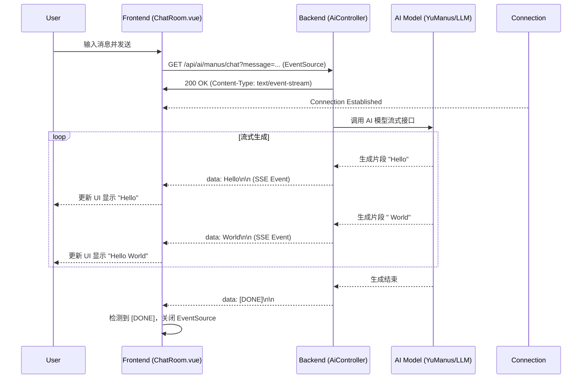

# yuoj-fron 与 yu-ai-agent-master SSE 交互文档

本文档详细说明了前端项目 `yuoj-fron` 与后端 AI 代理项目 `yu-ai-agent-master` 之间如何通过 Server-Sent Events (SSE) 技术进行实时流式交互。

## 1. 交互概述

SSE (Server-Sent Events) 允许服务器向浏览器单向推送数据。在本项目中，该技术用于 AI 聊天场景，使得 AI 的回复可以像打字机一样逐字显示（流式传输），而不是等待整个回复生成完毕后一次性显示。

**核心流程：**
1.  **建立连接**：前端 `ChatRoom` 组件调用 API 方法，通过 `EventSource` 对象向后端发起 GET 请求。
2.  **保持连接**：后端 `AiController` 接收请求，返回 `SseEmitter` 对象，保持 HTTP 连接不关闭。
3.  **流式推送**：后端业务逻辑（如 `YuManus` 或 `SportApp`）生成内容片段，控制器通过 `SseEmitter.send()` 将片段实时推送到前端。
4.  **前端接收**：前端 `EventSource.onmessage` 监听并追加消息内容到界面。
5.  **结束连接**：后端推送特定结束标记（如 `[DONE]`），前端识别后关闭连接。

## 2. 前端实现 (yuoj-fron)

### 2.1 API 封装 (`src/api/index.ts`)

前端通过 `EventSource` API 建立长连接。`api/index.ts` 中定义了具体的连接方法：

```typescript
// AI超级智能体应用 - SSE接口
export const doChatWithManus = (message: string) => {
  // 1. 构建请求 URL，包含参数
  const url = `/ai/manus/chat?message=${encodeURIComponent(message)}`

  try {
    // 2. 创建 EventSource 对象，发起连接
    // API_BASE_URL 通常配置为后端地址，如 http://localhost:8123/api
    return new EventSource(API_BASE_URL + url)
  } catch (error) {
    console.error('创建SSE连接失败:', error)
    throw new Error('创建连接失败: ' + (error as Error).message)
  }
}
```

### 2.2 组件调用 (`src/components/ChatRoom.vue`)

通用聊天组件 `ChatRoom.vue` 负责处理具体的 SSE 事件生命周期：

```javascript
// ...
// 建立新的SSE连接
try {
  // 调用传入的 api 方法获取 EventSource 实例
  eventSource = props.chatApi(messageToSend, chatId.value)

  // 监听消息事件
  eventSource.onmessage = (event) => {
    // 检查结束标记
    if (event.data === '[DONE]') {
      console.log('收到结束标记，关闭连接')
      eventSource.close()
      return
    }

    // 将收到的数据片段追加到当前消息内容中
    if (messages.value[aiMessageIndex]) {
      messages.value[aiMessageIndex].content += event.data
      scrollToBottom()
    }
  }

  // 监听连接建立
  eventSource.onopen = () => {
    console.log('SSE连接已建立')
  }

  // 监听错误
  eventSource.onerror = (error) => {
    // 处理连接关闭或网络错误
    console.error('SSE连接错误:', error)
    eventSource.close()
  }

} catch (error) {
  // ...
}
```

## 3. 后端实现 (yu-ai-agent-master)

后端基于 Spring MVC 的 `SseEmitter` 实现 SSE 推送。

### 3.1 控制器 (`src/main/java/com/yupi/yuaiagent/controller/AiController.java`)

控制器提供了对应的 GET 接口，返回 `SseEmitter`：

```java
@RestController
@RequestMapping("/ai")
public class AiController {

    /**
     * 流式调用 Manus 超级智能体
     */
    @GetMapping("/manus/chat")
    public SseEmitter doChatWithManus(String message) {
        // 创建 AI 代理实例
        YuManus yuManus = new YuManus(allTools, dashscopeChatModel);
        // runStream 方法内部会创建并返回 SseEmitter
        return yuManus.runStream(message);
    }
    
    // ... 其他 SSE 接口示例
    @GetMapping(value = "/love_app/chat/sse_emitter")
    public SseEmitter doChatWithLoveAppServerSseEmitter(String message, String chatId) {
        // 1. 创建 SseEmitter，设置超时时间（如 3分钟）
        SseEmitter sseEmitter = new SseEmitter(180000L); 
        
        // 2. 订阅响应式流 (Flux) 并推送到 SseEmitter
        sportApp.doChatByStream(message, chatId)
                .subscribe(chunk -> {
                    try {
                        // 发送数据片段
                        sseEmitter.send(chunk);
                    } catch (IOException e) {
                        sseEmitter.completeWithError(e);
                    }
                }, sseEmitter::completeWithError, sseEmitter::complete);
        
        // 3. 返回 Emitter 对象
        return sseEmitter;
    }
}
```

## 4. 交互时序图



## 5. 关键技术点

1.  **GET 请求**: `EventSource` 标准只支持 GET 请求，因此参数通过 URL Query 传递。
2.  **MIME Type**: 后端响应头必须包含 `Content-Type: text/event-stream`。
3.  **连接超时**: `SseEmitter` 默认超时时间较短，代码中手动设置了更长的超时时间（如 `180000L` 即 3 分钟）以适应 AI 生成可能的延迟。
4.  **结束判定**: 双方约定了 `[DONE]` 字符串作为流结束的信号，前端收到此信号后主动断开连接。

通过这种方式，`yuoj-fron` 和 `yu-ai-agent-master` 实现了高效、实时的 AI 对话体验。
