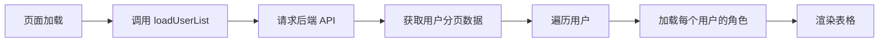
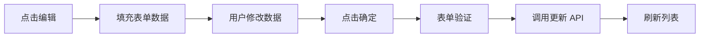
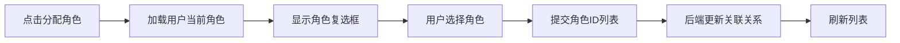

# 用户管理功能使用指南

## 📋 功能概述

超级管理员用户管理系统，提供完整的用户 CRUD 功能和 RBAC 角色分配功能。

---

## 🚀 功能特性

### 1. 用户列表展示
- ✅ 分页展示所有用户
- ✅ 显示用户基本信息（ID、头像、账号、名称、角色、简介、创建时间）
- ✅ 显示用户的 RBAC 角色标签
- ✅ 支持按账号、名称、角色搜索

### 2. 用户增删改查 (CRUD)
- ✅ **新增用户**: 创建新用户账号
- ✅ **编辑用户**: 修改用户信息（账号不可修改）
- ✅ **删除用户**: 删除指定用户（需二次确认）
- ✅ **查看用户**: 列表展示用户详细信息

### 3. 角色分配管理
- ✅ **分配角色**: 为用户分配一个或多个 RBAC 角色
- ✅ **移除角色**: 取消用户的角色分配
- ✅ **角色展示**: 实时显示用户当前拥有的角色

---

## 📍 访问路径

```
前端路由: /admin/users
菜单名称: 用户管理
权限要求: 管理员权限 (ACCESS_MUNE.ADMIN)
```

---

## 🎯 功能详解

### 1. 搜索功能

**搜索字段**:
- **用户账号**: 模糊搜索用户账号
- **用户名称**: 模糊搜索用户名称
- **用户角色**: 精确筛选用户角色（普通用户/管理员/封号）

**操作按钮**:
- 🔍 **搜索**: 执行搜索查询
- 🔄 **重置**: 清空搜索条件，显示所有用户
- ➕ **新增用户**: 打开新增用户弹窗

---

### 2. 用户表格

**表格列**:
| 列名 | 说明 | 宽度 |
|-----|------|------|
| ID | 用户唯一标识 | 80px |
| 头像 | 用户头像（默认图标） | 80px |
| 账号 | 用户登录账号 | 120px |
| 名称 | 用户显示名称 | 120px |
| 角色 | 系统角色（admin/user/ban） | 100px |
| RBAC角色 | 权限系统角色标签 | 200px |
| 简介 | 用户个人简介 | 自适应 |
| 创建时间 | 账号创建时间 | 180px |
| 操作 | 操作按钮组 | 250px |

**操作按钮**:
- 👥 **分配角色**: 打开角色分配弹窗
- ✏️ **编辑**: 编辑用户信息
- 🗑️ **删除**: 删除用户（需确认）

---

### 3. 新增用户

**必填字段**:
- ✅ **用户账号**: 唯一标识，用于登录
- ✅ **用户密码**: 登录密码

**选填字段**:
- ⭕ **用户名称**: 显示名称
- ⭕ **用户角色**: 系统角色（user/admin/ban），默认 user
- ⭕ **用户头像**: 头像 URL
- ⭕ **用户简介**: 个人简介（最多200字）

**表单验证**:
```typescript
// 必填验证
if (!userForm.userAccount) {
  Message.warning('请输入用户账号');
  return;
}

if (!userForm.userPassword) {
  Message.warning('请输入用户密码');
  return;
}
```

**对应后端接口**:
```java
POST /api/user/add
@RequestBody UserAddRequest {
  userAccount: string;      // 必填
  userPassword: string;      // 必填
  userName?: string;
  userRole?: string;
  userAvatar?: string;
  userProfile?: string;
}
```

---

### 4. 编辑用户

**可编辑字段**:
- ✅ 用户名称
- ✅ 用户角色
- ✅ 用户头像
- ✅ 用户简介
- ✅ 用户密码（选填，留空则不修改）

**不可编辑字段**:
- ❌ 用户账号（系统唯一标识）
- ❌ 用户 ID

**特殊说明**:
- 密码字段为空时，不会修改原密码
- 账号字段禁用编辑，确保数据一致性

**对应后端接口**:
```java
POST /api/user/update
@RequestBody UserUpdateRequest {
  id: number;               // 必填
  userName?: string;
  userRole?: string;
  userAvatar?: string;
  userProfile?: string;
  userPassword?: string;    // 选填
}
```

---

### 5. 删除用户

**操作流程**:
1. 点击"删除"按钮
2. 弹出确认对话框："确定要删除这个用户吗？"
3. 确认后执行删除操作
4. 删除成功后刷新列表

**安全机制**:
- ⚠️ 二次确认，防止误删
- ⚠️ 删除操作不可撤销

**对应后端接口**:
```java
POST /api/user/delete
@RequestBody DeleteRequest {
  id: number;
}
```

---

### 6. 分配角色

**功能说明**:
为用户分配或移除 RBAC 系统中的角色，支持多角色分配。

**操作流程**:
1. 点击用户行的"分配角色"按钮
2. 弹出角色分配弹窗
3. 显示当前用户信息和已有角色
4. 勾选/取消角色复选框
5. 点击"确定"提交更改

**角色展示**:
```vue
<a-checkbox :value="role.id">
  {{ role.roleName }}
  <a-tag>{{ role.roleKey }}</a-tag>
  <span>{{ role.description }}</span>
</a-checkbox>
```

**示例**:
```
☑ SuperAdmin (super_admin) - 系统超级管理员
☐ Coach (coach) - 教练员
☐ User (user) - 普通用户
```

**对应后端接口**:
```java
// 分配角色
POST /api/rbac/user/assignRoles
@RequestBody AssignRoleRequest {
  userId: number;
  roleIds: number[];
}

// 获取用户角色
GET /api/rbac/user/roles?userId={userId}
```

---

## 🔧 技术实现

### 前端技术栈

```typescript
// 核心框架
- Vue 3 (Composition API)
- TypeScript
- Arco Design Vue

// 状态管理
- reactive/ref (响应式数据)
- onMounted (生命周期钩子)

// API 调用
- UserControllerService (用户管理)
- RoleControllerService (角色管理)
- RbacControllerService (RBAC管理)
```

### 核心代码结构

```typescript
// 1. 数据定义
const searchForm = reactive({ ... });      // 搜索表单
const userList = ref<any[]>([]);          // 用户列表
const pagination = reactive({ ... });     // 分页信息
const userForm = reactive({ ... });       // 用户表单
const allRoles = ref<any[]>([]);          // 所有角色
const selectedRoleIds = ref<number[]>([]); // 选中的角色ID

// 2. 核心方法
loadUserList();          // 加载用户列表
loadUsersRoles();        // 加载用户角色
loadAllRoles();          // 加载所有角色
handleAdd();             // 新增用户
handleEdit(record);      // 编辑用户
handleDelete(id);        // 删除用户
handleAssignRoles(record); // 分配角色

// 3. API 调用示例
const res = await UserControllerService.listUserByPageUsingPost({
  current: pagination.current,
  pageSize: pagination.pageSize,
  userAccount: searchForm.userAccount,
  userName: searchForm.userName,
  userRole: searchForm.userRole,
});
```

---

## 📊 数据流转

### 1. 用户列表加载流程



### 2. 用户编辑流程



### 3. 角色分配流程



---

## 🎨 界面设计

### 布局结构

```
┌─────────────────────────────────────────────────────┐
│  用户管理                                             │
├─────────────────────────────────────────────────────┤
│  [用户账号] [用户名称] [用户角色▼] [🔍搜索] [🔄重置] [➕新增用户] │
├─────────────────────────────────────────────────────┤
│  ID │ 头像 │ 账号 │ 名称 │ 角色 │ RBAC角色 │ 简介 │ 时间 │ 操作   │
├─────┼──────┼──────┼──────┼──────┼──────────┼──────┼──────┼────────┤
│  1  │ 👤  │ admin│管理员│admin │SuperAdmin│...   │2024..│👥✏️🗑️│
│  2  │ 👤  │ user1│用户1 │user  │User      │...   │2024..│👥✏️🗑️│
└─────┴──────┴──────┴──────┴──────┴──────────┴──────┴──────┴────────┘
         [上一页]  1  2  3  [下一页]  每页10条
```

### 颜色规范

**角色标签颜色**:
- 🔴 管理员 (admin): `color="red"`
- 🔵 普通用户 (user): `color="blue"`
- ⚫ 封号 (ban): `color="gray"`
- 🟦 RBAC角色: `color="arcoblue"`

**按钮颜色**:
- 🟢 新增用户: `status="success"`
- 🟡 编辑: `status="warning"`
- 🔴 删除: `status="danger"`
- 🔵 分配角色: `type="text"`

---

## 🔒 权限控制

### 路由权限

```typescript
{
  path: "/admin/users",
  name: "用户管理",
  component: UserManagementView,
  meta: {
    access: ACCESS_MUNE.ADMIN,  // 需要管理员权限
    hideMenu: false,             // 显示在菜单中
  },
}
```

### 后端接口权限

所有用户管理接口都需要管理员权限：

```java
@AuthCheck(mustRole = UserConstant.ADMIN_ROLE)
public BaseResponse<Long> addUser(...) { ... }

@AuthCheck(mustRole = UserConstant.ADMIN_ROLE)
public BaseResponse<Boolean> updateUser(...) { ... }

@AuthCheck(mustRole = UserConstant.ADMIN_ROLE)
public BaseResponse<Boolean> deleteUser(...) { ... }
```

RBAC 接口需要相应的权限：

```java
@RequirePermission(value = {"rbac:user:assign_role"}, type = LogicalType.AND)
public BaseResponse<Boolean> assignRolesToUser(...) { ... }
```

---

## 📝 使用示例

### 示例 1: 创建新用户

1. 点击"新增用户"按钮
2. 填写表单:
   - 用户账号: `coach001`
   - 用户密码: `password123`
   - 用户名称: `张教练`
   - 用户角色: `user`
   - 用户简介: `篮球教练`
3. 点击"确定"
4. 提示"新增成功"

### 示例 2: 为用户分配教练角色

1. 在用户列表找到 `coach001`
2. 点击"分配角色"按钮
3. 勾选 "Coach (coach)" 角色
4. 点击"确定"
5. 列表中该用户的 RBAC角色 列显示 `Coach` 标签

### 示例 3: 批量操作流程

```typescript
// 1. 搜索特定用户
searchForm.userRole = 'user';  // 筛选普通用户
handleSearch();

// 2. 为所有普通用户分配 User 角色
userList.value.forEach(user => {
  handleAssignRoles(user);
  selectedRoleIds.value = [3]; // User 角色 ID
  handleAssignRolesSubmit();
});
```

---

## ⚠️ 注意事项

### 1. 数据安全
- ⚠️ 删除用户是不可逆操作，请谨慎操作
- ⚠️ 修改管理员角色可能影响系统安全
- ⚠️ 建议定期备份用户数据

### 2. 性能优化
- ✅ 使用分页加载，避免一次性加载大量数据
- ✅ 角色信息按需加载，减少不必要的请求
- ✅ 搜索条件变化时自动重置到第一页

### 3. 用户体验
- ✅ 所有操作都有成功/失败提示
- ✅ 删除操作需要二次确认
- ✅ 表单验证及时反馈错误信息
- ✅ 加载状态使用 loading 动画

### 4. 已知限制
- ⚠️ 不支持批量删除用户
- ⚠️ 不支持批量分配角色
- ⚠️ 用户账号创建后不可修改
- ⚠️ 密码加密在后端处理，前端不可见

---

## 🐛 常见问题

### Q1: 为什么看不到用户管理菜单？
**A**: 需要管理员权限。请确保：
1. 已登录管理员账号
2. 账号的 `userRole` 为 `admin`
3. 路由权限检查通过

### Q2: 分配角色后为什么不生效？
**A**: 可能的原因：
1. 后端接口返回失败，检查控制台错误信息
2. 用户需要重新登录才能获取新权限
3. RBAC 角色与系统角色（admin/user）是独立的

### Q3: 删除用户失败？
**A**: 可能的原因：
1. 用户有关联数据（如提交记录、帖子等）
2. 数据库外键约束限制
3. 建议先取消用户的所有关联，再进行删除

### Q4: 编辑用户后密码变了？
**A**: 如果在编辑时填写了密码字段，会更新密码。
**解决方案**: 编辑时不需要修改密码就留空。

---

## 🔄 后续优化计划

### 功能增强
- [ ] 批量删除用户
- [ ] 批量分配角色
- [ ] 用户导入/导出功能
- [ ] 用户活动日志查看
- [ ] 密码重置功能
- [ ] 用户头像上传

### 性能优化
- [ ] 虚拟滚动支持大量数据
- [ ] 角色信息缓存
- [ ] 防抖搜索
- [ ] 懒加载用户详情

### 用户体验
- [ ] 高级搜索（多条件组合）
- [ ] 用户状态筛选
- [ ] 操作日志记录
- [ ] 撤销删除功能

---

## 📚 相关文档

- [RBAC 系统实现总结](./IMPLEMENTATION_SUMMARY.md)
- [问题排查指南](./TROUBLESHOOTING.md)
- [快速开始指南](./QUICK_START.md)
- [API 接口文档](http://localhost:8121/api/doc.html)

---

**文档更新时间**: 2025-11-17  
**版本**: v1.0.0  
**维护人**: AI Assistant


